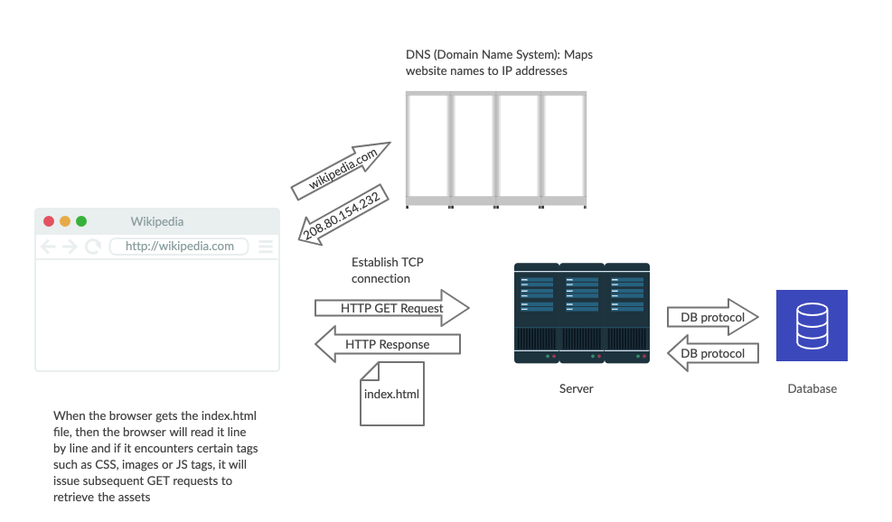

# Background

A popular question in first interviews like on Launch Day is "What happens when I type [website address] and click enter?" It's a good conversation that can take up a good duration of time and show your technical communication chops. It's also very good to know what the process is like to get something like wikipedia.com on our screens.

## What happens when we type wikipedia.com in our address bar and press enter

## Strategy Guide and Solution

### Diagram

The general steps that happen are as follows:

1. Type wikipedia.com into the address bar and press enter
2. The browser looks up the IP address for the domain name through the DNS
3. The browser establishes a TCP connection with the server
4. The browser sends an HTTP request to the server
5. The server receives and handles the request
6. The server sends out an HTTP response with a status code
7. The browser renders the barebones HTML
8. The browser reads the HTML line by line
9. If the browser encounters certain tags for CSS, JS or Images in the HTML, repeat steps 4-6 but with appropriate resource
10. Finish reading HTML line by line

### Discussion on Step 2: The browser looks up the IP address for the domain name through the DNS

If they are having trouble with this step, then you should encourage them to think about how snail mail might work or how a phone book works with a list of names and numbers. You can ask them, "How does the request know 'where to go'?"

A DNS (Domain Name System) is a database that has the webite URL and the IP address it matches with it.

An IP address is the computer identifier that hosts the server of the website we are asking to fetch.

### Discussion on step 3: The browser establishes a TCP connection with the server

They might jump straight to an HTTP request here which would be correct but it's good to introduce some nuance about that process. Ask them to think about to WebSockets and HTTP. Those protocols are using something. TCP is that thing. Think of TCP as an "open tunnel" that connects to our server

### Discussion on Step 4: The browser sends an HTTP request to the server

This is the start of the good ol' request-response cycle. Since we are just trying to retrieve wikipedia.com, this will be a GET request. A good discussion to have here is about the headers in such a request. What information might the headers have? Some examples are:

- Cookie information (if applicable)
- User-Agent which is an identifier of the browser/application or operating system or whatever is the requesting resource
- HOST which "host" and port number of the server to which the request is being sent

### Discussion on Step 5: The server receives and handles the request

The request can be handled in many different ways. It depends on what exactly the request headers are indicating as well as what was developed by the developers of the application.

Since we are looking to view wikipedia.com, it will prepare a response that will be the the HTML of the page. Other responses can be in the form of XML or JSON.

### Discussion on Step 6: The server sends out an HTTP response with a status code

Usually in the first line of the response, it will show a status code. A good discussion here is to discuss what status codes will show based on certain cases such as requesting an invalid resource.

Status Codes:

- 1xx - just informational message
- 2xx - usually a success
- 3xx - redirects the client to another URL
- 4xx - client error
- 5xx - server error

### Discussion on Step 7: The browser renders the barebones HTML

Have them think back to Juke for this step and the subsequent steps. Have them also think about all the times where they request a site and then it doesn't show the CSS immediately until maybe a split second but they noticed it. Have them think about having data that's not there yet.

In this step, it just renders the barebones HTML without anything else.

### Discussion on Step 8: The browser reads the HTML line by line

Thinking back to Juke, we discussed that the browser reads the HTML line by line. If they are having trouble with this, you can ask them about the `defer` tag that defers execution of scripts until the end of the HTML reading. Or ask them about what happens if there and scripts or images that are hosted somewhere else inside the HTML? Does everything comeback in that first request?

### Discussion on Step 9: If the browser encounters certain tags for CSS, JS or Images in the HTML, repeat steps 4-6 but with appropriate resource

Since the browser just loads the barebones HTML and reads it line by line, then whatever other resources we may have such as scripts, CSS and media will not be loaded/rendered yet. So, when the browser gets to a specific tag indicating the HTML needs another resource, it will issue requests back to the server (or other servers depending where these resources live) to retrieve these resources until the browser is done reading the HTML line by line.
