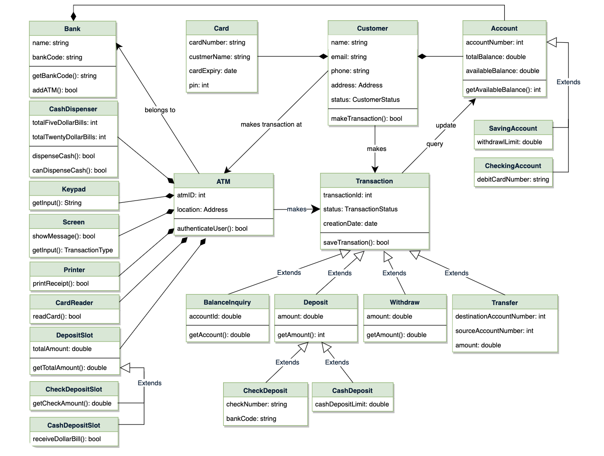
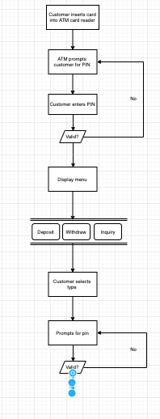

# Design an ATM

## Requirements and Goals of an ATM

- Takes in a card and authenticates user
- User has the option to deposit, withdraw and view balance

### Main Components of an ATM

- Card reader
- Keypad
- Screen
- Cash dispenser
- Deposit slot
- Receipt slot
- Network infrastructure

### Main Functionality of an ATM

- Check balance
- Deposit (cash; we can do check but it's optional here)
- Withdrawal
- Transfer (optional)

### Actors of an ATM System

#### Operator

- Turn ATM ON/OFF
- Refill ATM with cash, receipts, ink
- Take out deposited checks and cash

#### Customer

- See Main functionality

#### Bank Admin

- Generate reports based on operator

## Classes of an ATM System

- ATM: Can have an ATMID to distinguish it from other ATMs as well as a location as properties
- Keypad: Where we enter PIN or amounts
- Screen: Different screens and messages shown; could be a touch screen ATM
- Printer: Print receipts
- CashDispenser: The ATM component that dispenses cash
- DepositSlot: The ATM component that accepts cash
- Bank: Which bank owns the ATM/holds customer account info
- CardReader: The ATM component that reads the magnetic strip
- Account: User account information
- Customer: General user information
- Card: The actual card
- Transaction: What type of transaction it can be

## Sample Activity Diagrams

### Authentication

### Deposit

### Withdrawal

## Additional Discussion Points

Nearing the end of the problem, we can choose to discuss how might we want to add additional features to our ATM:

- What if we wanted to add a transfer money option?
- What if we wanted to add credit card accounts or investment accounts?
